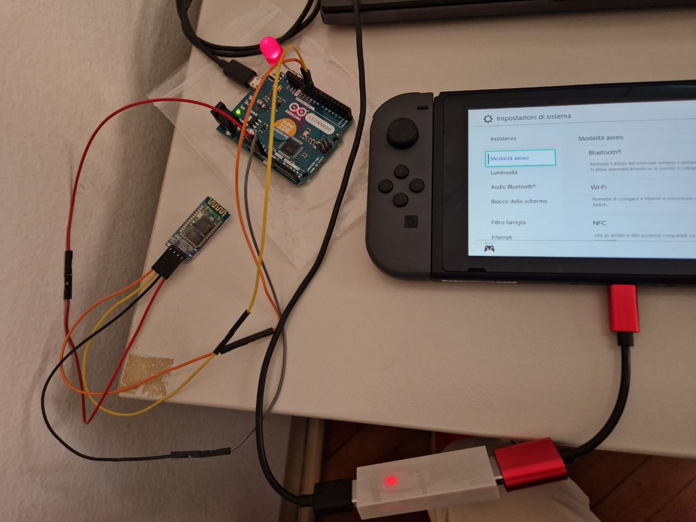

# Inputs-Converger
1) A Python Library that can converge inputs from PC (Face/Body tracking, Voice commands, ecc) and communicate them to a serial port.
2) An Arduino-compatible device that can simulate to be a Gamepad, read from serial communication and send xinputs, accordingly, to gaming consoles.

All this can be used for accessibility purposes, to enable people with complex motor disabilities to play videogames on gaming consoles, by using software AI-based solutions that are running on their computer.

# Credits
Thanks to
* [ArduinoXInput](https://github.com/dmadison/ArduinoXInput)
* [Pyserial](https://github.com/pyserial/pyserial)

for enabling this project!

